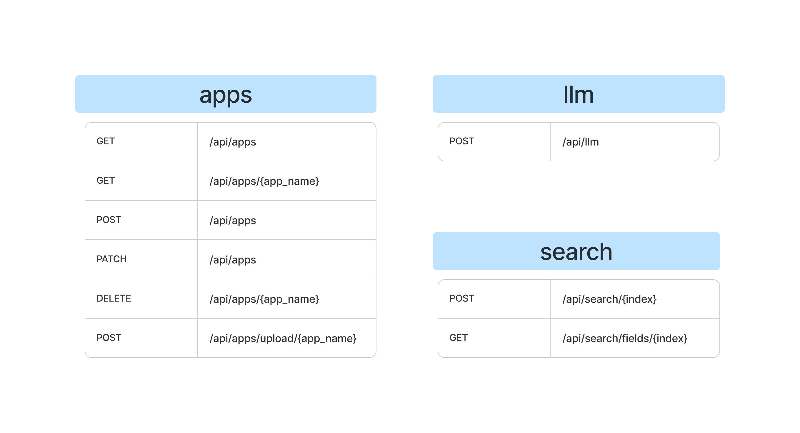
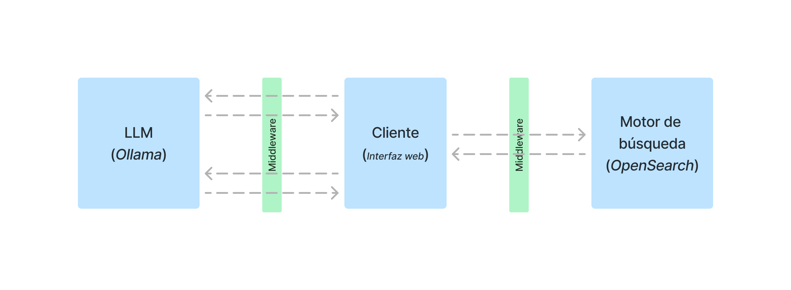

# Middleware
This container will connect the search engine and the large language model (LLM) to form the Large Search Model (LSM). To interact with the LSM, there is a web client that facilitates user interaction through this middleware interface.

To access to the
<a href="http://localhost:2002" target="_blank">web client</a>
you will need to install this application, follow the [root instructions](../README.md).

# API REST Routes summary
The LSM REST API has three different routes

- llm (using Ollama)
- search (using OpenSearch)
- app (using OpenSearch)

## LLM

Using the post method `/api/llm/` This will make a chat conversation with the LLM configured using the Ollama API.

## Search

Using the post method `/api/search/` it will search relevant information about the terms attached in the index indicated.

## App

Using the OpenSearch search engine, it will store the metadata of the applications of the LSM. Name, description, the context to get the terms in the text and the context messages to get the conclusions.

| **HTTP Method** | **Endpoint**             | **Description**                                                                     |
|-----------------|--------------------------|-------------------------------------------------------------------------------------|
| POST            | `/api/apps/`             | Creates or updates an application                                                   |
| POST            | `/api/apps/upload/{app_name}` | Uploads data to the app index                                                        |
| DELETE          | `/api/apps/{app_name}`   | Deletes the specified application                                                   |
| PATCH           | `/api/apps/`             | Updates the application, including renaming                                          |
| GET             | `/api/apps/`             | Returns metadata for all applications                                               |
| GET             | `/api/apps/{app_name}`   | Returns metadata for the specified application                                      |

# Communication flow

All the steps needed for the communication, to achieve making a LSM, or the integration between a LLM and a search engine:

1. **Client (Web Interface)** sends a message to the **Middleware**.
2. **Middleware** forwards the message to the **LLM (Ollama)** to obtain terms.
3. **LLM (Ollama)** processes the message, extracts terms, and sends them back to the **Middleware**.
4. **Middleware** sends the extracted terms back to the **Client (Web Interface)**.
5. **Client (Web Interface)** sends a search query to the **Middleware** with the obtained terms.
6. **Middleware** forwards the search query to the **Search Engine (OpenSearch)**.
7. **Search Engine (OpenSearch)** responds with the most relevant documents.
8. **Middleware** sends the documents back to the **Client (Web Interface)**.
9. **Client (Web Interface)** sends the original message and documents to the **Middleware** for generating conclusions.
10. **Middleware** forwards these to the **LLM (Ollama)**.
11. **LLM (Ollama)** generates a conclusion and sends it back to the **Middleware**.
12. **Middleware** sends the conclusion to the **Client (Web Interface)** as output.