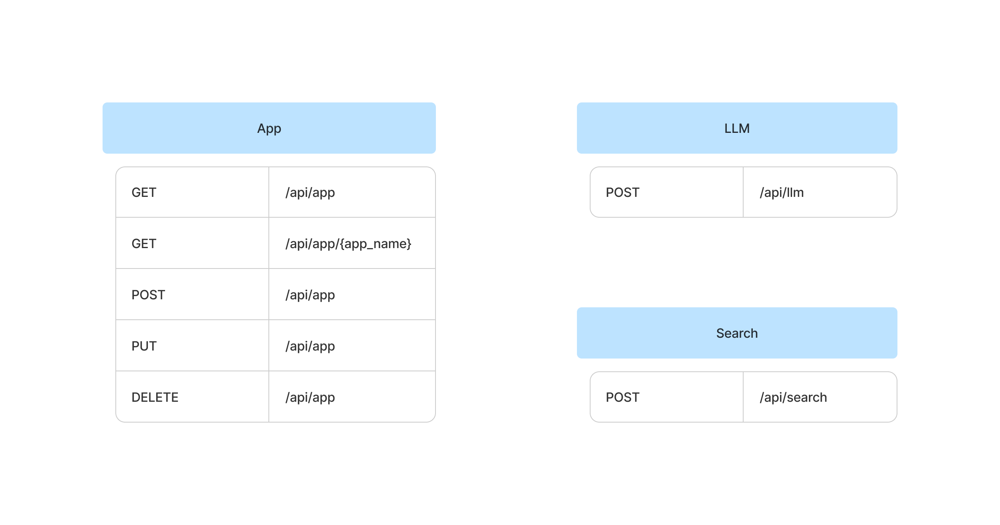

# Middleware

This middleware consist in 3 different routes

- llm (using Ollama)
- search (using OpenSearch)
- app (using OpenSearch)

 **LSM API SUMMARY**

## LLM

Using the post method `/api/llm/` This will make a chat conversation with the LLM configured using the Ollama API.

## Search

Using the post method `/api/search/` it will search relevant information about the terms attached in the index indicated.

## App

Using the OpenSearch search engine, it will store the metadata of the applications of the LSM. Name, description, the context to get the terms in the text and the context messages to get the conclusions.
